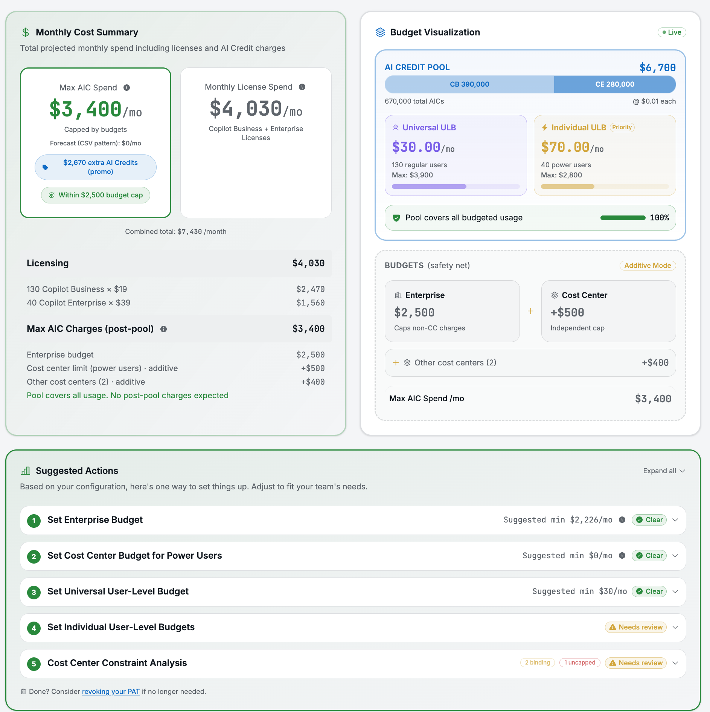
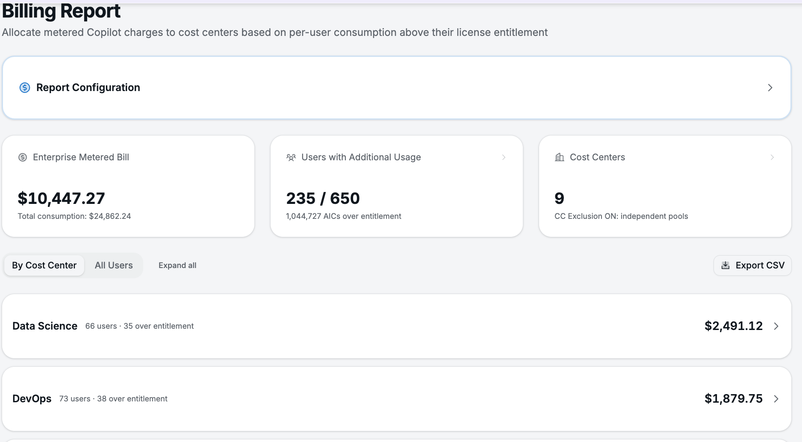
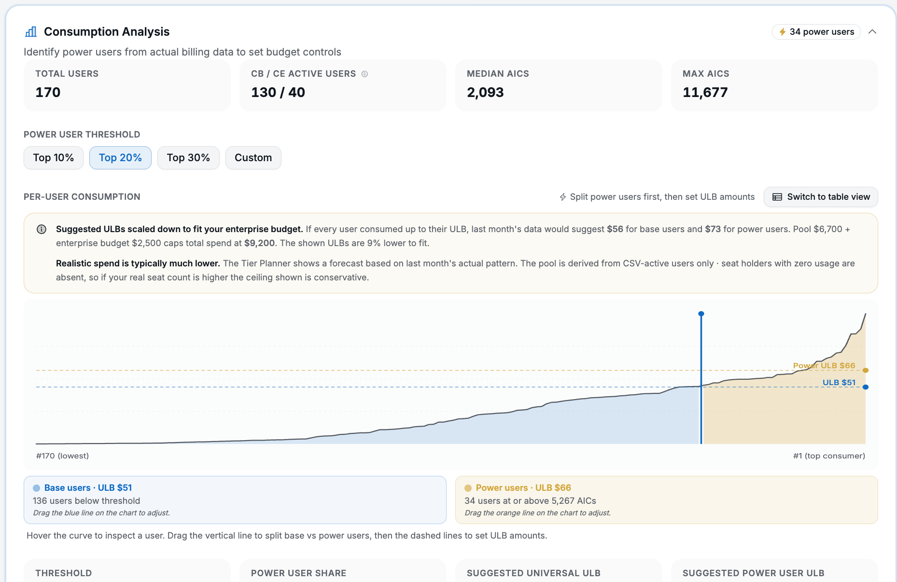

# Copilot Budget Command Calculator

**The missing control plane for GitHub Copilot's usage-based billing.**

_Visualize the budget hierarchy, model scenarios, and push changes to your enterprise — all from a single browser tab with no backend._

[](LICENSE)
[](https://react.dev)
[](https://vitejs.dev)
[](#docker-recommended)
[](#-screenshots)

[**→ Open the live app**](https://xrvk.github.io/copilot-budget-command-calculator/)

[Quick Start](#-quick-start) · [Features](#-features) · [Connect your enterprise](#-connect-your-enterprise) · [Security](#-security--token-handling) · [License](#-license)

---

> [!IMPORTANT]
> **Disclaimer:** This tool is an independent, personal project built by a GitHub Solutions Engineer to help customers and the broader community plan Copilot usage-based billing budgets. It is **not** an official GitHub product, does not represent GitHub's views, and is not endorsed or supported by GitHub.
>
> Recommendations are based on the inputs you provide and the billing model as understood at the time of development. **Past usage patterns may not predict future usage.** GitHub may change pricing, credit allocations, or billing mechanics at any time. Always verify recommendations against [GitHub's official documentation](https://docs.github.com/en/copilot/managing-copilot/managing-github-copilot-in-your-organization/managing-the-spending-policy-for-github-copilot-in-your-organization) and your own billing data before applying changes.

---

## 📸 Screenshots

| Budget Planner | Tier Planner | Billing Report |
|:-:|:-:|:-:|
| [](.github/screenshots/budget-planner.png) | [](.github/screenshots/tier-planner.png) | [](.github/screenshots/billing-report.png) |
| Import & edit live budgets | Guided sizing + Entitlement Pool | Allocate metered spend back to teams |

| Consumption Analysis | API Tools |
|:-:|:-:|
| [](.github/screenshots/tier-planner-consumption.png) | [](.github/screenshots/api-tools.png) |
| Detect power users from real usage | Ready-to-run shell scripts & Actions |

---

## 🎯 Why this exists

GitHub Copilot's usage-based billing gives enterprises layered controls: enterprise spending limits, cost center budgets, universal and individual user-level budgets (ULBs). Configuring them today means navigating docs, API calls, and spreadsheets across multiple pages. Common tasks like mapping enterprise teams to cost centers or keeping membership in sync require custom scripts the platform doesn't yet provide.

This app gives you a single screen to **see**, **model**, **execute** and **report** on the whole budget hierarchy.

---

## ✨ Features

| 📊 Plan | 🛠️ Execute | 📖 Understand |
|:--|:--|:--|
| Interactive Entitlement Pool diagram | Push budget edits back via GitHub API | Tips tab explains the billing model |
| Guided Tier Planner wizard | Bulk individual ULB scripts | Deep-linkable sections to share |
| Budget Lock for fixed-ceiling sizing | Team → cost center sync (Actions) | Pool vs. metered cost breakdown |
| CSV consumption analysis | Cycle-reset budget automation | Constraint analysis explanations |
| Promo Optimizer for seat mix | Bulk POST/PATCH/DELETE budgets | Cost center exclusion guide |
| Per-cost-center billing reports | Auto-resolve org members for CCs | ULB strategy & gaming pitfalls |

The app ships **six tabs**, each focused on one phase of the budget lifecycle:

<details>
<summary><b>Budget Planner</b> — import, edit, and push live budgets</summary>


Import live cost centers and budgets from GitHub, edit inline, review a diff of pending changes, and push updates back. Tracks drift on **Exclude cost centers** and **Stop usage** settings so you know when the API state has changed under you. Shows per-cost-center spend for the current billing month.

**CSV consumption import**: upload a billing export to identify power users and tune the Tier Planner. CSV data also pre-fills the Billing Report tab automatically.

**Consumption Analysis** (shown below) reads actual per-user AIC consumption from your CSV and recommends ULB splits scaled to fit your enterprise budget.


</details>

<details>
<summary><b>Tier Planner</b> — guided sizing for budgets &amp; ULBs</summary>


A guided workflow that sizes your enterprise spending limit, assigns a power user cost center, sets the universal ULB, and bulk-creates individual user budgets. Each step executes against the API and flows selections to the next. The wizard adapts its steps to your enterprise configuration.

Includes an interactive **Entitlement Pool Diagram** showing how licenses, ULBs, and spending limits relate across all layers, with hover tooltips on every number.

**Budget Lock**: lock a fixed enterprise budget cap and instantly see the maximum affordable ULB / power-user budget, with per-field "Within budget" or "Over budget · set to $X" annotations and tradeoff hints.

**Billing-cycle adjustment**: account for pool credits already consumed this cycle. When connected, pool consumption auto-populates from your cost center spend.

**Cost-center constraint analysis** (Step 5): cross-references each cost center's budget against its users' actual ULBs to detect binding constraints. Resolves Organization-type resources automatically.

</details>

<details>
<summary><b>Billing Report</b> — allocate metered spend to teams</summary>


Generate per-user and per-department billing allocation reports from CSV data or live cost center spend, with a single Export CSV button. CSV data uploaded in Budget Planner automatically pre-fills the report. Demo mode renders a pre-generated 650-user enterprise-scale report immediately.

</details>

<details>
<summary><b>Promo Optimizer</b> — buy the right seat mix during promos</summary>

During promotional periods, included AI Credits are cheaper per-credit than metered pricing. The optimizer auto-fetches your seat counts and calculates the exact Copilot Business / Enterprise mix needed to offset your enterprise budget with included credits, showing cost comparison and break-even analysis.

</details>

<details>
<summary><b>API Tools</b> — ready-to-run scripts &amp; Actions</summary>


Ready-to-run shell scripts and GitHub Actions workflows for:

- **Individual user budgets** — bulk-create or update ULBs for your power-user group
- **Team-to-cost-center sync** — sync enterprise team members into a cost center (shell or scheduled Action)
- **Cycle-reset budget** — reset an enterprise budget to its full-cycle value at the start of a new billing period
- **List all budgets** — retrieve every configured budget for your enterprise

Enterprise URL and token auto-fill from your connection. Token format is validated inline before you run.

</details>

<details>
<summary><b>Tips &amp; Best Practices</b> — learn the model</summary>

A full education module on how Copilot's billing actually works: visual cards covering pool mechanics, the four budget controls, an interactive cost breakdown, numbered setup tips, and advanced strategies for ULB management. Each section is deep-linkable (e.g. `/#tips?section=diagnosis&popup=0`) so you can share specific topics with colleagues.

</details>

---

## 🚀 Quick Start

### Docker (recommended)

```bash
docker build -t copilot-budget-command-calculator .
docker run -d -p 8080:80 copilot-budget-command-calculator
```

Open [http://localhost:8080](http://localhost:8080).

### Run locally

Requires Node.js 22+ (Active LTS).

```bash
npm install
npm run dev
```

Open [http://localhost:5002/](http://localhost:5002/).

---

## 🔌 Connect your enterprise

This app runs **entirely in your browser**. There is no backend server. All API calls go directly from your browser to `api.github.com` (or your GHE.com subdomain). Nothing is sent to any intermediary, and credentials are held in memory only for the duration of your browser tab (never persisted to disk, cookies, or local storage). See [Security & Token Handling](#-security--token-handling) for full details.

**No credentials required to explore.** The app always starts in demo mode with sample data. When you're ready to connect to a real enterprise, either dismiss the demo banner (✕) to auto-connect using local dev credentials, or click **Connect your enterprise →** to open the Import panel. All tabs share a single connection, shown as a compact green badge.

A variant toggle in the demo banner lets you switch between **With CCs** (3 cost centers, exclusion ON) and **No CCs** (flat enterprise billing) to see how the app adapts.

On first visit, a welcome walkthrough popup introduces each tab. Re-open anytime via the **?** button in the header, or add `?popup=0` to the URL to suppress it.

### PAT scopes

Requires a classic PAT with: `manage_billing:enterprise`, `read:org`.

The app probes for `read:org` on connect and shows a warning if it's missing (needed for org member resolution in constraint analysis). Token format is validated inline with regex checks for `ghp_` (classic) and `github_pat_` (fine-grained) prefixes.

### Local development credentials

Pre-fill the Import panel for local dev by copying `.env.local.example`:

```bash
cp .env.local.example .env.local
```

Set `VITE_DEV_ENTERPRISE_URL` and `VITE_DEV_PAT` to enable auto-connect when dismissing the demo banner.

---

## 🔒 Security & token handling

Your PAT is:

- **Sent directly** to the GitHub API (`api.github.com` or your GHE.com subdomain) — never to any intermediary
- **Held in memory only** for the duration of your browser tab — lost on refresh
- **Never persisted** to disk, cookies, or local storage

For maximum security, **self-host** via Docker on your own infrastructure:

```bash
docker build -t copilot-budget-command-calculator .
docker run -d -p 8080:80 copilot-budget-command-calculator
```

We recommend [creating a dedicated PAT](https://github.com/settings/tokens?type=beta) for each session and [revoking it](https://github.com/settings/tokens) when done.

---

## 📄 License

[MIT](LICENSE) — use freely, contribute gladly.
