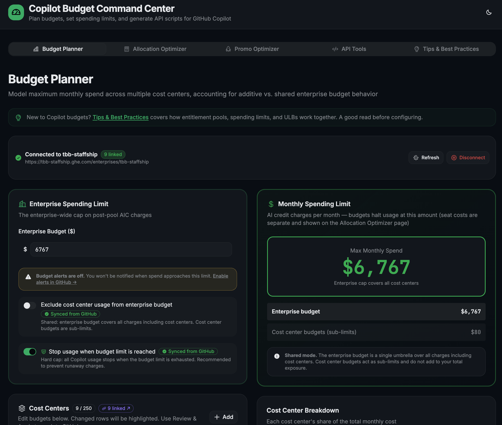
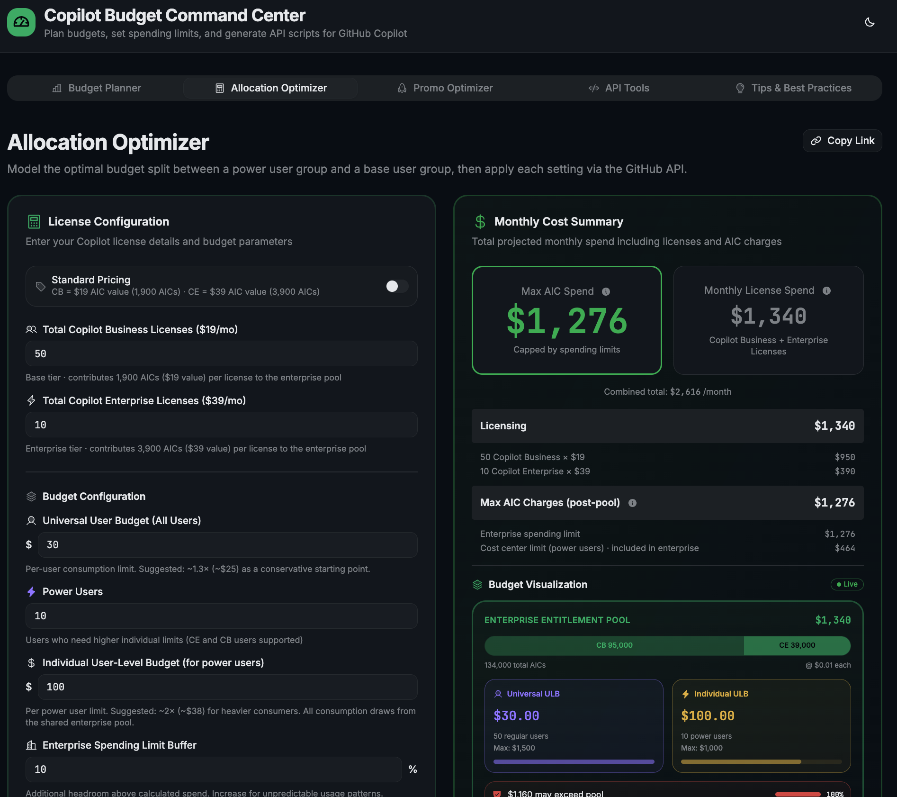
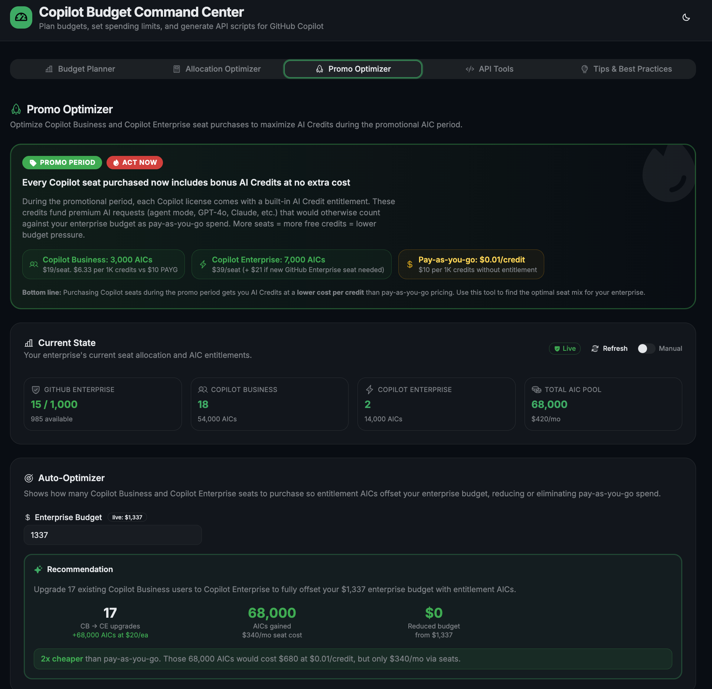
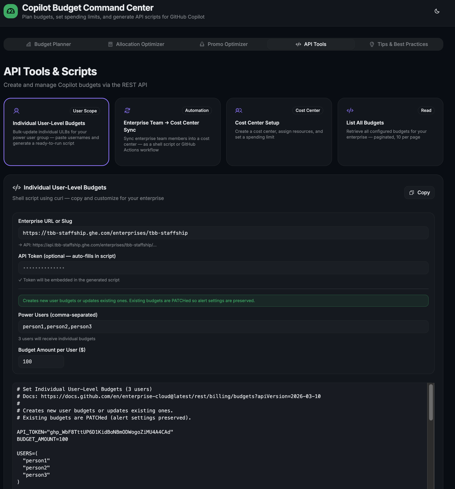
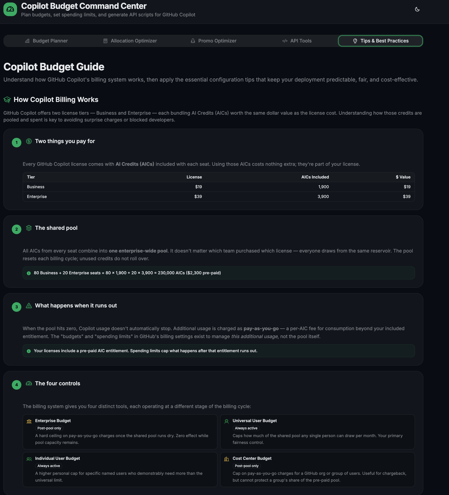

# Copilot Budget Command Calculator (CCC)

The missing control plane for GitHub Copilot's usage-based billing. Visualize the budget hierarchy, model scenarios, and push changes to your enterprise — all from a single browser tab with no backend.

**[→ Open the app](https://vigilant-barnacle-l4o98y7.pages.github.io/)**


### Why this exists

GitHub Copilot's usage-based billing gives enterprises layered controls: enterprise spending limits, cost center budgets, universal and individual user-level budgets. Configuring them today means navigating docs, API calls, and spreadsheets across multiple pages. Common tasks like mapping enterprise teams to cost centers or keeping membership in sync require custom scripts the platform doesn't yet provide.

### What you can do

- 🗺️ **See the full picture** — an interactive pool diagram shows how licenses, AI credits, and budget controls relate across all four layers, updated live as you change inputs
- 📥 **Import and edit live data** — connect with a classic PAT, pull your cost centers and budgets from GitHub, edit inline, and push changes back
- 📊 **Analyze consumption from CSV** — upload a billing CSV to see a sorted bar chart of per-user consumption, auto-detect power users with one click, and apply the results directly to the Tier Planner
- 🧭 **Follow a guided setup** — the Tier Planner walks you from enterprise spending limit through cost center assignment to individual user budgets, executing each step against the API. Adapts dynamically: enterprises without cost centers see a streamlined 3-step wizard
- 🔒 **Start from a fixed budget** — Budget Lock lets you set an enterprise budget cap and instantly see the maximum affordable per-user limits, with tradeoff hints when you need to balance regular and power user allocations
- ⏱️ **Adjust for billing cycle** — account for pool credits already consumed when creating or adjusting budgets during a billing cycle, with auto-populated usage data when connected
- 🚀 **Optimize seat purchases** — the Promo Optimizer shows exactly which Copilot seats to buy so included credits offset your enterprise budget, replacing metered spend with cheaper per-seat credits
- 💰 **Generate billing reports** — produce per-user and per-department billing allocation reports from CSV data or live cost center spend
- 🛠️ **Generate automation scripts** — ready-to-run shell scripts and GitHub Actions workflows for bulk user budgets, team-to-cost-center sync, cycle-reset automation, and more
- 📖 **Learn before you configure** — the Tips tab teaches how Copilot billing actually works, with deep-linkable sections you can share with colleagues

---

## Features

### Budget Planner



Import live cost centers and budgets from GitHub, edit inline, review a diff of pending changes, and push updates back. Tracks drift on "Exclude cost centers" and "Stop Usage" settings so you know when the API state has changed under you. Shows per-cost-center spend data for the current billing month.

**CSV consumption analysis**: Upload a billing CSV to see a sorted bar chart of per-user AI Credit consumption. Click any user row to set the power user cutoff, then apply the detected values (seat counts, ULB, power user budget) directly to the Tier Planner with a configurable growth buffer. CSV data also pre-fills the Billing Report tab automatically.

### Tier Planner



A guided 5-step workflow that sizes your enterprise spending limit, assigns a power user cost center, sets the universal ULB, and bulk-creates individual user budgets. Each step executes against the API and flows selections to the next. When your enterprise has no cost centers, the wizard dynamically adapts to a streamlined 3-step flow, hiding CC-related steps and renumbering automatically.

Includes an interactive **Entitlement Pool Diagram** showing how licenses, ULBs, and spending limits relate across all layers, with hover tooltips on every number.

**Budget Lock**: Toggle on to lock a fixed enterprise budget cap and instantly see the maximum affordable ULB and power user budget. When cost center exclusion is on, a separate CC budget cap input appears. A budget math summary shows how your cap breaks down (seat costs vs. available consumption), and per-field annotations tell you whether your current settings fit ("✓ Within budget") or exceed ("⚠ Over budget. Set to $X to fit your cap") the locked ceiling. Tradeoff tips show the exact target value to balance regular and power user limits.

**Billing cycle adjustment**: Toggle "Adjust for Billing Cycle" to account for pool credits already consumed this cycle. When connected, pool consumption is auto-populated from your cost center spend data. In demo mode, a date-based simulation shows how recommendations shift throughout the month. A persistent reminder warns you to reset budgets at the start of the next billing cycle, with a link to the cycle-reset script.

**Cost center constraint analysis** (Step 5): Cross-references each cost center's budget against its users' actual ULBs to detect binding constraints. Resolves Organization-type resources automatically. Alerts when you're not a member of all orgs in a cost center, with a link to review unaffiliated organizations.

### Promo Optimizer



During promotional periods, included AI Credits are cheaper per-credit than metered pricing. The optimizer auto-fetches your seat counts and calculates the exact CB/CE seat mix needed to offset your enterprise budget with included credits, showing cost comparison and breakeven analysis.

### Billing Report

Generate per-user and per-department billing allocation reports from CSV data or live cost center spend. CSV data uploaded in Budget Planner automatically pre-fills the report. In demo mode, a pre-generated 650-user enterprise-scale report is shown immediately.

### API Tools



Ready-to-run shell scripts and GitHub Actions workflows for:

- **Individual user budgets** — bulk-create or update individual ULBs for your power user group
- **Team-to-cost-center sync** — sync enterprise team members into a cost center, as a shell script or scheduled GitHub Action
- **Cycle-reset budget** — reset an enterprise budget to its full-cycle value at the start of a new billing period (shell script or monthly cron workflow)
- **List all budgets** — retrieve all configured budgets for your enterprise

Enterprise URL and token auto-fill from your connection. When connected, cycle-reset inputs auto-populate from your enterprise budget with "Synced" badges. Token format validation catches invalid PATs before you run the script.

### Tips & Best Practices



A full education module on how Copilot's billing actually works: visual cards covering pool mechanics, the four budget controls, an interactive cost breakdown, numbered setup tips, and advanced strategies for ULB management. Each section is deep-linkable (e.g. `/#tips?section=diagnosis&popup=0`) so you can share specific topics with colleagues.

---

## Connecting to Your Enterprise

This app runs **entirely in your browser**. There is no backend server. All API calls go directly from your browser to `api.github.com` (or your GHE.com subdomain). Nothing is sent to any intermediary, and credentials are held in memory only for the duration of your browser tab (never persisted to disk, cookies, or local storage). See [Security & Token Handling](#security--token-handling) for full details.

**No credentials required to explore.** The app always starts in demo mode with sample data. When you're ready to connect to a real enterprise, either dismiss the demo banner (X button) to auto-connect using local dev credentials, or click "Connect your enterprise →" to open the Import panel. All tabs share a single connection, shown as a compact green badge.

After connecting, the app probes for the `read:org` scope and shows a warning if it's missing (needed for org member resolution in constraint analysis). Token format is validated inline with regex checks for `ghp_` (classic) and `github_pat_` (fine-grained) prefixes.

The demo mode banner can be dismissed with the ✕ button (reappears on reload). To hide it permanently, add `?banner=0` to the URL. A variant toggle in the banner lets you switch between two demo scenarios: "With CCs" (3 cost centers, exclusion ON) and "No CCs" (flat enterprise billing) to see how the app adapts.

On first visit, a welcome walkthrough popup introduces each tab. It can be re-opened anytime via the **?** button in the header. To suppress it entirely, add `?popup=0` to the URL.

## Quick Start

### Docker (recommended)

```bash
docker build -t copilot-budget-command-calculator .
docker run -d -p 8080:80 copilot-budget-command-calculator
```

Open [http://localhost:8080](http://localhost:8080).

### Run locally

Requires Node.js 22+ (Active LTS).

```bash
npm install
npm run dev
```

Open [http://localhost:5002/](http://localhost:5002/).

## Security & Token Handling

Your PAT is:

- Sent **directly** to the GitHub API (`api.github.com` or your GHE.com subdomain) — never to any intermediary
- Held **in memory only** for the duration of your browser tab — lost on refresh
- **Never persisted** to disk, cookies, or local storage

For maximum security, **self-host** via Docker on your own infrastructure:

```bash
docker build -t copilot-budget-command-calculator .
docker run -d -p 8080:80 copilot-budget-command-calculator
```

This gives you full control over the environment where tokens are entered. We recommend [creating a dedicated PAT](https://github.com/settings/tokens?type=beta) for each session and [revoking it](https://github.com/settings/tokens) when done.

### Local development credentials

Pre-fill the Import panel for local development by copying `.env.local.example`:

```bash
cp .env.local.example .env.local
```

Set `VITE_DEV_ENTERPRISE_URL` and `VITE_DEV_PAT` to enable auto-connect when dismissing the demo banner. The app always starts in demo mode. Clicking the ✕ on the demo banner auto-connects to your enterprise when these env vars are set.

## License

MIT

